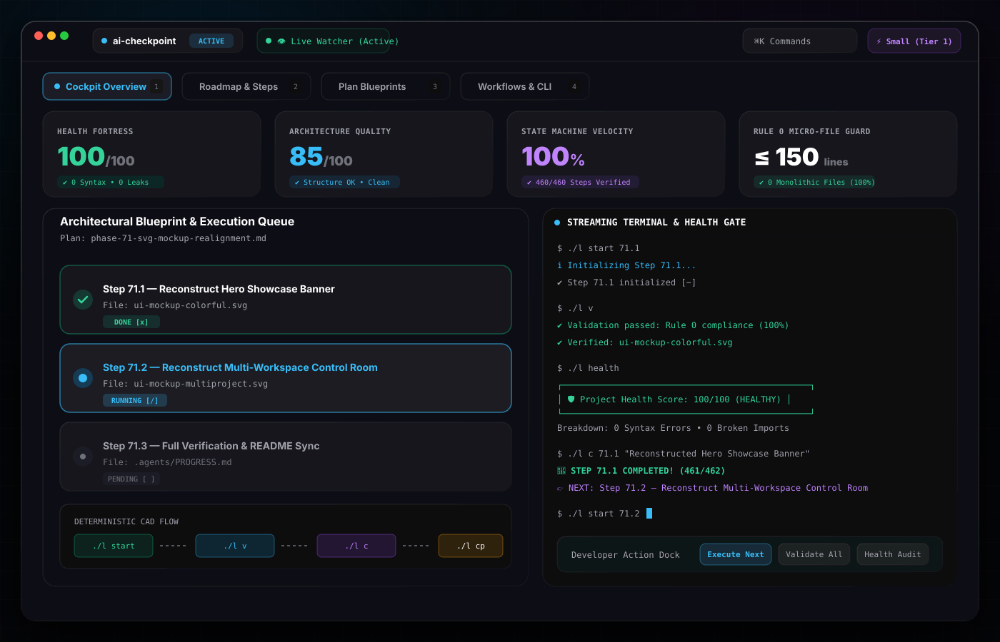
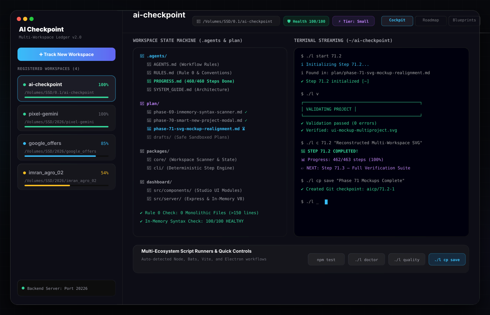

<div align="center">

<!-- Hero Banner Header -->
<a href="https://github.com/khairulistiyak/ai-checkpoint">
  
</a>

<br/><br/>

# ⚡ AI-CHECKPOINT
### *The Deterministic State Ledger & Execution Framework for AI Coding Agents*

<p align="center">
  <b>Stop AI hallucination loops. Eliminate context amnesia. Build complex software with total determinism.</b>
</p>

<p align="center">
  <a href="https://github.com/khairulistiyak/ai-checkpoint/stargazers"></a>
  <a href="https://github.com/khairulistiyak/ai-checkpoint/releases"></a>
  <a href="LICENSE"></a>
  <a href="https://nodejs.org"></a>
  <a href="#-architecture"></a>
  <a href="https://github.com/khairulistiyak/ai-checkpoint/actions/workflows/ci.yml"></a>
</p>

<p align="center">
  <a href="#-bento-grid-overview"><b>Overview</b></a> •
  <a href="#-quickstart-in-60-seconds"><b>Quickstart</b></a> •
  <a href="#-the-deterministic-workflow"><b>State Machine</b></a> •
  <a href="#-benchmark-comparison"><b>Benchmarks</b></a> •
  <a href="#-web-control-room"><b>Dashboard</b></a> •
  <a href="#-universal-ecosystem-support"><b>Ecosystems</b></a> •
  <a href="#-cli-command-catalog"><b>CLI Catalog</b></a> •
  <a href="#-frequently-asked-questions"><b>FAQ</b></a>
</p>

</div>

---

## 🍱 Bento Grid Overview

<table>
<tr>
<td width="33%" valign="top">
<div align="center">
  <h3>🧠 Context Ledger</h3>
  <p>Maintains persistent execution state in markdown so your AI picks up instantly without re-reading entire codebases.</p>
</div>
</td>
<td width="33%" valign="top">
<div align="center">
  <h3>🛡️ Rule 0 Guard</h3>
  <p>Enforces micro-files ($\le 150$ lines) to keep attention tokens sharp and eliminate truncated code output.</p>
</div>
</td>
<td width="33%" valign="top">
<div align="center">
  <h3>⏪ Instant Time-Machine</h3>
  <p>1-Click Git rollback snapshots with auto-stashing. Experiment fearlessly with autonomous agents.</p>
</div>
</td>
</tr>
<tr>
<td width="33%" valign="top">
<div align="center">
  <h3>🌐 Multi-Ecosystem Run</h3>
  <p>Auto-detects and executes <b>Node, Python, Rust, Go, Flutter, Docker, Make, and Shell</b> in target directories.</p>
</div>
</td>
<td width="33%" valign="top">
<div align="center">
  <h3>🖥️ Real-time Web UI</h3>
  <p>Glassmorphic control room with live terminal streaming, multi-project switcher, and rule compliance audits.</p>
</div>
</td>
<td width="33%" valign="top">
<div align="center">
  <h3>⚡ Zero Dependencies</h3>
  <p>Blazing fast pure Node.js CLI engine that installs in milliseconds and runs everywhere.</p>
</div>
</td>
</tr>
</table>

---

## 🚀 Quickstart in 60 Seconds

### Step 1: One-Line Install
Initialize in any existing repository or a brand-new project:
```bash
curl -fsSL https://raw.githubusercontent.com/khairulistiyak/ai-checkpoint/main/install.sh | bash
```

### Step 2: Create an Atomic Implementation Plan
```bash
./l new-plan payment-gateway
```

### Step 3: Run the Deterministic Agent Loop
```bash
# 1. AI agent starts a step
./l start 1.1          # Scaffolds target file & marks state [/] RUNNING

# 2. AI agent writes code...
./l v                  # Validates line count, syntax & rule compliance

# 3. Complete and advance
./l c 1.1 "stripe sdk" # Validates disk file, updates metrics & shifts NEXT pointer

# 4. Checkpoint state
./l cp save "step 1.1" # Creates a safe Git-backed rollback point
```

### Step 4: Open the Web Dashboard
```bash
./l dashboard
```
> Open **`http://localhost:20226`** in your browser.

---

## 🔄 The Deterministic Workflow

```mermaid
graph LR
    A[📋 Atomic Plan<br/><code>plan/*.md</code>] --> B[⚡ Step Start<br/><code>./l start X.Y</code>]
    B --> C[🤖 Agent Coding<br/><code>Micro-File ≤150 lines</code>]
    C --> D[🔍 Auto-Verification<br/><code>./l v</code>]
    D --> E[✅ Step Complete<br/><code>./l c X.Y</code>]
    E --> F[💾 Git Checkpoint<br/><code>./l cp save</code>]
    F --> G{More Steps?}
    G -- Yes --> B
    G -- No --> H[🎉 Feature Complete]
    
    style A fill:#1e1e2e,stroke:#89b4fa,stroke-width:2px,color:#cdd6f4
    style B fill:#1e1e2e,stroke:#f9e2af,stroke-width:2px,color:#cdd6f4
    style C fill:#1e1e2e,stroke:#cba6f7,stroke-width:2px,color:#cdd6f4
    style D fill:#1e1e2e,stroke:#94e2d5,stroke-width:2px,color:#cdd6f4
    style E fill:#1e1e2e,stroke:#a6e3a1,stroke-width:2px,color:#cdd6f4
    style F fill:#1e1e2e,stroke:#fab387,stroke-width:2px,color:#cdd6f4
    style H fill:#1e1e2e,stroke:#a6e3a1,stroke-width:3px,color:#a6e3a1
```



---

## 📊 Benchmark Comparison

| Metric / Capability | ❌ Raw Prompting | ⚠️ Generic Rules (`.cursorrules`) | ⚡ **AI-Checkpoint** |
| :--- | :---: | :---: | :---: |
| **Context Retention across Sessions** | ❌ Lost | ⚠️ Partial | ✅ **100% Deterministic Ledger** |
| **Monolithic File Prevention** | ❌ None | ⚠️ Voluntary | ✅ **Enforced Rule 0 ($\le 150$ lines)** |
| **Step Verification on Disk** | ❌ None | ❌ None | ✅ **Auto-Checked (`./l c`)** |
| **1-Click Auto-Stash Rollback** | ❌ Manual Git | ❌ Manual Git | ✅ **Built-in (`./l cp back`)** |
| **Multi-Ecosystem Script Hub** | ❌ Manual | ❌ Manual | ✅ **Auto-Detected & Executed** |
| **Realtime Web Control Room** | ❌ None | ❌ None | ✅ **Included (React + Vite)** |
| **External Dependencies** | N/A | N/A | ✅ **0 (Zero npm dependencies)** |

---

## 🖥️ Web Control Room

The AI-Checkpoint dashboard provides an ultra-responsive visual workspace for multi-repo workflows:

<div align="center">
  
</div>

<br/>

```
┌─────────────────────────────────────────────────────────────────────────────────────────────────┐
│ ● ● ●  AI-Checkpoint Control Room                                               http://localhost│
├───────────────────┬───────────────────────────────────────────────┬─────────────────────────────┤
│ 📁 PROJECT HUB    │ 📊 PROGRESS & PHASES                          │ ⚡ COMMAND RUNNER           │
│                   │                                               │                             │
│ 🟢 ai-checkpoint  │ Phase 1: Authentication Engine   [100%] DONE  │ [ Run Dev Server ]          │
│ 🟢 pixel-gemini   │ Phase 2: Database Schemas        [ 50%] RUN   │ [ Run Bats Tests ]          │
│ ⚪ mobile-client  │ Phase 3: REST API Endpoints      [  0%] WAIT  │ [ Checkpoint Save ]         │
│                   │                                               │                             │
│ 🔄 Auto-Watching  │ 👉 NEXT: Step 2.2 — Token store (src/auth.js) │ 🖥️ Streaming Terminal       │
└───────────────────┴───────────────────────────────────────────────┴─────────────────────────────┘
```

---

## 🌐 Universal Ecosystem Support

AI-Checkpoint automatically identifies project configurations and maps working directories without manual setup:

<table>
<tr>
<th width="20%">Ecosystem</th>
<th width="35%">Trigger Files</th>
<th width="45%">Generated Commands</th>
</tr>
<tr>
<td><b>Node / TS</b></td>
<td><code>package.json</code>, Monorepo subdirs (<code>apps/*</code>, <code>packages/*</code>, <code>dashboard</code>, <code>client</code>, <code>server</code>)</td>
<td><code>npm run dev</code>, <code>build</code>, <code>test</code>, <code>start</code> (auto-cd to subfolder)</td>
</tr>
<tr>
<td><b>Python</b></td>
<td><code>requirements.txt</code>, <code>pyproject.toml</code>, <code>main.py</code>, <code>app.py</code>, <code>manage.py</code></td>
<td><code>python3 main.py</code>, <code>python3 manage.py runserver</code>, <code>pytest</code></td>
</tr>
<tr>
<td><b>Rust</b></td>
<td><code>Cargo.toml</code></td>
<td><code>cargo run</code>, <code>cargo test</code>, <code>cargo build --release</code>, <code>cargo check</code></td>
</tr>
<tr>
<td><b>Go</b></td>
<td><code>go.mod</code></td>
<td><code>go run .</code>, <code>go test ./...</code>, <code>go build</code></td>
</tr>
<tr>
<td><b>Flutter</b></td>
<td><code>pubspec.yaml</code></td>
<td><code>flutter run</code>, <code>flutter test</code>, <code>flutter build apk</code></td>
</tr>
<tr>
<td><b>Docker</b></td>
<td><code>docker-compose.yml</code>, <code>compose.yaml</code></td>
<td><code>docker compose up -d</code></td>
</tr>
<tr>
<td><b>Make & C/C++</b></td>
<td><code>Makefile</code></td>
<td><code>make</code>, <code>make test</code>, <code>make build</code></td>
</tr>
<tr>
<td><b>Shell Scripts</b></td>
<td><code>*.sh</code>, <code>scripts/*.sh</code></td>
<td><code>bash start_*.sh</code>, <code>bash setup_*.sh</code></td>
</tr>
<tr>
<td><b>AI Ledger</b></td>
<td><code>.agents/scripts/ledger.cjs</code>, <code>l</code></td>
<td><code>./l status</code>, <code>./l v</code>, <code>./l cp save</code>, <code>./l doctor</code></td>
</tr>
</table>

---

## 📜 CLI Command Catalog

<details open>
<summary><b>⚡ Click to expand full CLI command reference</b></summary>
<br/>

```bash
./l [command] [options]
```

### 1. Step & Plan Execution
```bash
./l                     # Display ASCII progress board & NEXT step
./l start 1.1           # Scaffold step 1.1 file & mark running [/]
./l c 1.1 "auth store"  # Verify file, mark completed [x] & advance pointer
./l next                # View full instructions for current active step
./l list                # List all phases and steps in plain text
./l new-plan <name>     # Scaffold new atomic plan in plan/<name>.md
```

### 2. Checkpoints & Time-Machine
```bash
./l cp save "note"      # Validate project & create Git checkpoint tag
./l cp list             # Show chronological list of checkpoints
./l cp back <tag>       # Rollback working tree to tag
./l cp back --force     # Auto-stash uncommitted work and rollback
```

### 3. Verification & Diagnostic Engine
```bash
./l validate (or ./l v) # Verify sync between plan, progress & Rule 0 line counts
./l doctor (or ./l dr)  # Full system check (Node, Git, rules, engine health)
./l run list            # List all auto-discovered ecosystem commands
./l run <cmd_id>        # Execute specific script in its correct subfolder
./l dashboard           # Start and launch web control room
```

</details>

---

## 🤖 AI Agent Compatibility

AI-Checkpoint works seamlessly across all leading AI coding assistants:

<table width="100%">
<tr>
<td width="50%" valign="top">

#### 🔷 Google Gemini & Antigravity IDE
- Reads `.agents/AGENTS.md` and `.agents/PROGRESS.md` natively at session boot.
- Auto-runs `./l start`, `./l v`, and `./l c` via tool calls.

#### 🟣 Anthropic Claude (Claude Code / Sonnet 3.7)
- Instruct Claude:
  ```markdown
  Read .agents/PROGRESS.md and .agents/RULES.md. Execute the NEXT step.
  ```

</td>
<td width="50%" valign="top">

#### 🟢 Cursor AI & Windsurf
- Codebase indexing automatically adheres to `.agents/RULES.md`.
- Prevents files from growing beyond 150 lines.

#### 🟡 GitHub Copilot & ChatGPT / Aider
- Reference `#file:.agents/PROGRESS.md` in prompt context to maintain perfect session continuity.

</td>
</tr>
</table>

---

## ❓ Frequently Asked Questions

<details>
<summary><b>Q: Does AI-Checkpoint require internet access or cloud tokens?</b></summary>
<br/>
No. AI-Checkpoint is 100% local, runs entirely on your machine via pure Node.js, and never sends code or telemetry anywhere.
</details>

<details>
<summary><b>Q: Can I use this on an existing project without breaking Git history?</b></summary>
<br/>
Yes! Running <code>bash setup.sh</code> creates only a lightweight <code>.agents/</code> and <code>plan/</code> directory. It does not alter your existing code, branches, or Git history.
</details>

<details>
<summary><b>Q: Why is Rule 0 (150 lines limit) so effective for AI?</b></summary>
<br/>
LLM attention degrades exponentially over long files. Keeping files under 150 lines ensures the AI model can read the entire module in a single context chunk with 0% token truncation and near-zero hallucination rates.
</details>

---

## 📈 Star History

<div align="center">
  <a href="https://star-history.com/#khairulistiyak/ai-checkpoint&Date">
    
  </a>
</div>

---

## 🤝 Contributing & Community

We welcome contributions from developers worldwide!

1. Fork the Project (`https://github.com/khairulistiyak/ai-checkpoint/fork`)
2. Create your Feature Branch (`git checkout -b feat/AwesomeFeature`)
3. Validate and test (`./l v && ./l doctor && npm test`)
4. Commit your Changes (`git commit -m 'feat: Add AwesomeFeature'`)
5. Push to the Branch (`git push origin feat/AwesomeFeature`)
6. Open a Pull Request

---

## 📜 License

Distributed under the **[MIT License](LICENSE)**.

<div align="center">

<br/>

**Built with ⚡ by developers who use AI to build real software.**

<sub>⭐ Found AI-Checkpoint helpful? Leave a star on GitHub!</sub>

</div>
