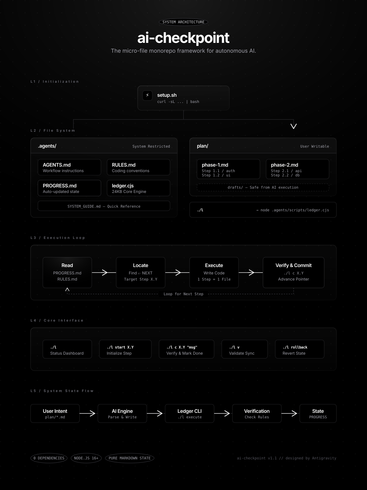

<div align="center">

<p align="center">
  
</p>

# ⚡ AI-Checkpoint

### *The Deterministic Execution Ledger & State Machine for AI Coding Agents*

**Your AI forgets context. AI-Checkpoint never does.**  
A zero-dependency framework and real-time dashboard that coordinates autonomous AI coding agents (Gemini, Claude, GPT, Cursor, Copilot, Windsurf) into structured, verifiable, atomic workflows.

---

[](https://github.com/khairulistiyak/ai-checkpoint/stargazers)
[](LICENSE)
[](https://nodejs.org)
[](#architecture)
[](#installation)
[](https://github.com/khairulistiyak/ai-checkpoint/pulls)

<br/>

[🚀 30-Sec Quickstart](#-30-second-quickstart) •
[🌟 Core Features](#-core-features) •
[🖥️ Web Dashboard](#-real-time-web-dashboard) •
[🌐 Multi-Ecosystem Matrix](#-universal-multi-ecosystem-engine) •
[📜 CLI Reference](#-comprehensive-cli-reference) •
[🤖 AI Integration](#-ai-agent-compatibility)

</div>

---

## ⚡ The Problem vs The Solution

```
❌ WITHOUT AI-CHECKPOINT:
  Prompt ➔ AI hallucinates ➔ Skips step 3 ➔ Overwrites step 1 ➔ Files become 800+ lines ➔ Context window collapses ➔ Project breaks 💥

✅ WITH AI-CHECKPOINT:
  Plan ➔ Atomic Step (≤150 lines) ➔ Auto-Verification ➔ Progress Ledger Updated ➔ Git Checkpoint Saved ➔ 100% Deterministic Progress 🚀
```

| Problem with AI Coding | How AI-Checkpoint Solves It |
| :--- | :--- |
| **Context Window Amnesia** | Stores continuous execution state in `.agents/PROGRESS.md` so any AI picks up right where it stopped. |
| **Silent Failures & False Completes** | Auto-verifies file existence, content validity, and lint rules before allowing a step to mark "Done". |
| **Monolithic Spaghetti Code** | Enforces **Rule 0** (≤150 lines per file) and barrel export modularity across the entire codebase. |
| **Unrecoverable AI Breakages** | One-command Git checkpoint snapshots (`./l cp save`) and instant auto-stash rollback (`./l cp back`). |
| **Multi-Stack Execution Chaos** | Auto-detects and runs **Node, Python, Rust, Go, Flutter, Docker, Make, and Shell** commands in correct subfolders. |

---

## 🚀 30-Second Quickstart

### 1. Initialize in Any Existing or New Project
```bash
# In your project root:
curl -fsSL https://raw.githubusercontent.com/khairulistiyak/ai-checkpoint/main/install.sh | bash
```

### 2. Create an Atomic Plan
```bash
./l new-plan user-authentication
```

### 3. Let Your AI Execute with Total Control
```bash
./l start 1.1           # Creates file boilerplate, marks step IN_PROGRESS
# AI Agent writes the code...
./l v                   # Validates architecture & line-count rules
./l c 1.1 "auth schema" # Verifies file on disk, updates ledger & advances NEXT pointer
./l cp save "step 1.1"  # Instant Git-backed rollback checkpoint
```

### 4. Launch the Visual Web Dashboard
```bash
./l dashboard
```
> Open **`http://localhost:20226`** for the real-time glassmorphic control center.

---

## 🌟 Core Features

<div align="center">
  
</div>

<br/>

### 1. 🧠 Immutable Progress Ledger
- Tracks phases, steps, completion status, and active blockers in human- and machine-readable Markdown (`.agents/PROGRESS.md`).
- Generates an interactive ASCII progress board in your terminal.

### 2. 🛡️ Architectural Rule 0 & Rule 1 Guard
- **Rule 0 (Micro-Files)**: Strictly bounds files to $\le 150$ effective lines, enforcing high cohesion and easy AI context parsing.
- **Rule 1 (Atomic Steps)**: Mandates 1 step = 1 file with strict `File`, `Action`, `Done-check`, and `Depends` declarations.

### 3. ⏪ Zero-Risk Git Rollbacks
- Create snapshot tags with `./l cp save "checkpoint note"`.
- View revision timeline with `./l cp list`.
- Roll back instantaneously with auto-stashing via `./l cp back --force <tag>`.

### 4. ⚡ Universal Multi-Ecosystem Run & Command Engine
- No more guessing build commands or `cd` paths. AI-Checkpoint auto-discovers scripts across monorepos and diverse language stacks.

---

## 🖥️ Real-Time Web Dashboard

A blazing-fast, modern web interface built with **React + Vite + WebSockets + Terminal Streamer**:

<div align="center">
  
</div>

- **📁 Multi-Project Hub**: Switch between all your local repositories with auto-file watching.
- **📊 Real-time Progress Gauge**: Live phase completion bars and interactive step inspection.
- **⚡ Run & Command Panel**: One-click execution for dev servers, test suites, builds, shell scripts, and ledger commands.
- **🖥️ Embedded Terminal**: Real-time stdout/stderr streaming with ANSI color rendering and process termination.
- **🛡️ Rules Compliance Auditor**: Scans the workspace for Rule 0 violations with line-count metrics.
- **⏪ Checkpoint Time Machine**: Visual list of all checkpoint snapshots with 1-click restore.

---

## 🌐 Universal Multi-Ecosystem Engine

AI-Checkpoint automatically identifies and configures run commands for all major languages and frameworks:

| Ecosystem | Detected Config / Files | Generated Commands |
| :--- | :--- | :--- |
| **Node.js / TS** | `package.json`, Monorepos (`apps/*`, `packages/*`, `dashboard`, `frontend`, `backend`) | `npm run dev`, `build`, `test`, `start` with auto-`cd` |
| **Python** | `requirements.txt`, `pyproject.toml`, `main.py`, `app.py`, `manage.py` | `python3 main.py`, `python3 manage.py runserver`, `pytest` |
| **Rust** | `Cargo.toml` | `cargo run`, `cargo test`, `cargo build --release`, `cargo check` |
| **Go** | `go.mod` | `go run .`, `go test ./...`, `go build` |
| **Flutter / Mobile** | `pubspec.yaml` | `flutter run`, `flutter test`, `flutter build apk` |
| **Docker** | `docker-compose.yml`, `compose.yaml` | `docker compose up -d` |
| **C / C++ / Build** | `Makefile` | `make`, `make test`, `make build` |
| **Shell Runners** | `*.sh`, `scripts/*.sh` | `bash start_*.sh`, `bash setup_*.sh` |
| **Ledger Control** | `.agents/scripts/ledger.cjs`, `l` | `./l status`, `./l v`, `./l cp save` |

---

## 📜 Comprehensive CLI Reference

```bash
./l [command] [options]
```

### Execution & Steps
| Command | Shortcut | Description |
| :--- | :--- | :--- |
| `./l status` | `./l` | Display terminal progress dashboard & next step |
| `./l start <X.Y>` | `./l s <X.Y>` | Initialize step file boilerplate and mark `[/] IN_PROGRESS` |
| `./l complete <X.Y> [msg]` | `./l c <X.Y> [msg]` | Verify file on disk, mark `[x] COMPLETED`, update percentage |
| `./l next` | `./l n` | Show detailed instructions for the immediate pending step |
| `./l list` | `./l ls` | List all phases and steps in plain text |

### Checkpoints & Recovery
| Command | Shortcut | Description |
| :--- | :--- | :--- |
| `./l cp save [note]` | `./l save [note]` | Validate workspace and create a Git checkpoint tag |
| `./l cp list` | `./l checkpoints` | List all available checkpoints and timestamps |
| `./l cp back <tag>` | `./l rollback <tag>` | Rollback working tree to checkpoint (use `--force` to stash) |

### Validation & Tools
| Command | Shortcut | Description |
| :--- | :--- | :--- |
| `./l validate` | `./l v` | Run full monorepo, progress sync, and Rule 0 line checks |
| `./l doctor` | `./l dr` | System health check (Node, Git, rules, file integrity) |
| `./l run list` | `./l r ls` | List all auto-detected ecosystem scripts and commands |
| `./l run <id>` | `./l r <id>` | Execute a detected script in its designated working directory |
| `./l dashboard` | `./l ui` | Start and open the visual web dashboard |
| `./l new-plan <name>` | `./l np <name>` | Generate an atomic plan scaffold in `plan/<name>.md` |

---

## 🤖 AI Agent Compatibility

AI-Checkpoint works natively out of the box with any modern AI coding assistant:

<div align="center">

| AI Tool | Integration Method | Capabilities |
| :---: | :---: | :---: |
| **Google Gemini / Antigravity** | Auto-loads `.agents/AGENTS.md` | Full agentic loop, step execution, validation |
| **Anthropic Claude (Code / 3.7)** | Native file tool & command execution | Reads progress, executes `./l` commands |
| **Cursor AI** | Auto-indexed in codebase rules | Adheres to `.agents/RULES.md` & step pointer |
| **Windsurf / Codeium** | Cascade memories & workspace rules | Auto-tracks next step and checkpoint tags |
| **GitHub Copilot Workspace** | Context references (`#file:PROGRESS.md`) | Guided atomic code generation |
| **Cline / Roo Code** | Terminal & file system permissions | Fully autonomous plan-to-completion workflow |
| **Aider** | CLI orchestrator | Git checkpoint synchronization |

</div>

---

## 📁 Repository Structure

```
your-project/
├── .agents/                    # 🤖 Agent Configuration & Ledger
│   ├── AGENTS.md               # Directives & workflow instructions for AI
│   ├── PROGRESS.md             # Active step ledger and completion metrics
│   ├── RULES.md                # Coding conventions and Rule 0 definitions
│   └── scripts/ledger.cjs      # Zero-dependency execution engine
├── plan/                       # 📋 Atomic implementation plans
│   ├── add-feature.md          # Step-by-step atomic specifications
│   └── drafts/                 # Scratchpads & research notes
├── dashboard/                  # 🖥️ Visual Web Dashboard (React + Vite)
│   ├── src/                    # UI Components & WebSocket Terminal
│   └── server.js               # Multi-project watcher & API backend
└── l                           # ⚡ Universal CLI wrapper
```

---

## 🛠️ Requirements & Installation

- **Node.js**: `v18.0.0` or higher
- **Git**: `2.0` or higher
- **Dependencies**: **0 (Zero npm dependencies for core CLI)**
- **Operating Systems**: macOS, Linux, Windows (WSL2 / Git Bash)

### Global Installation via NPM
```bash
npm install -g ai-checkpoint
```

### Local Setup Script
```bash
git clone https://github.com/khairulistiyak/ai-checkpoint.git
cd ai-checkpoint
bash setup.sh
```

---

## 🤝 Contributing

Contributions are what make the open-source community an amazing place to learn, inspire, and create. Any contributions you make are **greatly appreciated**!

1. Fork the Project (`https://github.com/khairulistiyak/ai-checkpoint/fork`)
2. Create your Feature Branch (`git checkout -b feature/AmazingFeature`)
3. Validate your changes (`./l v && ./l doctor`)
4. Run tests (`npm run test`)
5. Commit your Changes (`git commit -m 'feat: Add AmazingFeature'`)
6. Push to the Branch (`git push origin feature/AmazingFeature`)
7. Open a Pull Request

---

## 📜 License

Distributed under the **MIT License**. See [`LICENSE`](LICENSE) for more information.

---

<div align="center">

**Built with ❤️ for developers who build the future with AI.**

<sub>⭐ If AI-Checkpoint saved your context, give it a star on GitHub!</sub>

</div>
