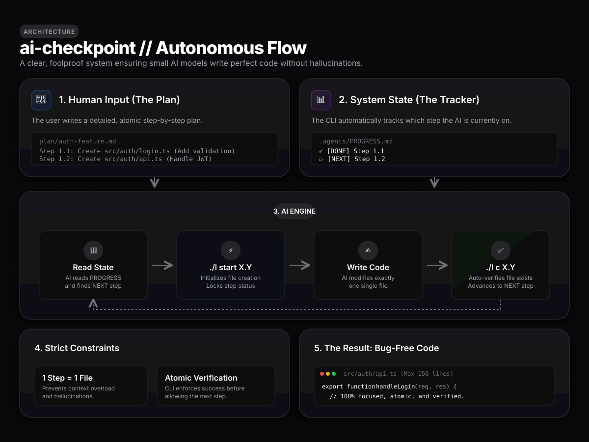

<div align="center">

<p align="center">
  
</p>

# ⚡ AI-Checkpoint

### **The Deterministic Execution Ledger & State-Machine for AI Coding Agents**

<p align="center">
  <b>Your AI forgets context. AI-Checkpoint never does.</b><br/>
  An ultra-lightweight, zero-dependency state engine and real-time dashboard that coordinates autonomous AI coding agents (Gemini, Claude, GPT-4o, Cursor, Copilot, Windsurf) into bulletproof, atomic, and verifiable workflows.
</p>

<p align="center">
  <a href="https://github.com/khairulistiyak/ai-checkpoint/stargazers"></a>
  <a href="LICENSE"></a>
  <a href="https://nodejs.org"></a>
  <a href="#-architecture"></a>
  <a href="#-installation"></a>
  <a href="https://github.com/khairulistiyak/ai-checkpoint/actions"></a>
</p>

<p align="center">
  <a href="#-why-ai-checkpoint"><b>Why AI-Checkpoint?</b></a> •
  <a href="#-30-second-quickstart"><b>30-Sec Quickstart</b></a> •
  <a href="#-core-pillars"><b>Core Pillars</b></a> •
  <a href="#-real-time-web-dashboard"><b>Web Dashboard</b></a> •
  <a href="#-universal-multi-ecosystem-matrix"><b>Run Engine</b></a> •
  <a href="#-comprehensive-cli-reference"><b>CLI Reference</b></a> •
  <a href="#-ai-agent-compatibility"><b>AI Setup</b></a>
</p>

</div>

---

## 💥 The AI Coding Dilemma vs The Solution

<table width="100%">
<tr>
<td width="50%" valign="top">

### 🔴 The Chaos Mode *(Without AI-Checkpoint)*
- 🔁 **Amnesia Loops:** Agent loses conversation history after 15-20 turns and rewrites already completed files.
- ⏭️ **Skipped Steps:** Skips crucial tests, migrations, or dependencies during multi-file refactoring.
- 🍝 **Monolithic Spaghetti:** Generates 800+ line monster files that choke the model's context window.
- 💣 **Unrecoverable Breakages:** When an agent produces broken code, you have to manually parse git diffs or start over.

</td>
<td width="50%" valign="top">

### 🟢 The Ledger Mode *(With AI-Checkpoint)*
- 🧠 **Deterministic State Ledger:** `.agents/PROGRESS.md` guarantees the AI always knows what’s done and what’s next.
- 🛡️ **Auto-Verification Gate:** `./l c X.Y` verifies file existence, non-emptiness, and syntax before checking off steps.
- 📐 **Rule 0 Guard (Micro-Files):** Files stay strictly $\le 150$ lines, guaranteeing optimal AI context efficiency.
- ⏪ **1-Click Time Machine:** Instant Git-backed rollback tags (`./l cp save`) with auto-stashing recovery.

</td>
</tr>
</table>

---

## 🚀 30-Second Quickstart

```bash
# 1. Initialize AI-Checkpoint in any existing or new repo
curl -fsSL https://raw.githubusercontent.com/khairulistiyak/ai-checkpoint/main/install.sh | bash

# 2. Scaffold a clean atomic plan
./l new-plan feature-auth

# 3. Step execution workflow
./l start 1.1          # Creates boilerplate & marks step running [/]
# ... AI agent writes the code ...
./l v                  # Validates line count & syntax rules
./l c 1.1 "auth model" # Verifies file on disk, updates ledger & points to NEXT
./l cp save "step 1.1" # Creates an instantaneous Git rollback tag
```

```bash
# 4. Open the Real-time Web Dashboard
./l dashboard
```
> 🚀 Access the visual control room at **`http://localhost:20226`**

---

## 🏛️ Architecture & Workflow

<div align="center">
  
</div>

<br/>

```
┌─────────────────┐       ┌─────────────────┐       ┌─────────────────┐
│   1. PLAN       │ ────> │   2. EXECUTE    │ ────> │  3. CHECKPOINT  │
│  plan/*.md      │       │  ./l start X.Y  │       │  ./l cp save    │
│  Atomic Steps   │       │  ./l c X.Y      │       │  Safe Rollback  │
└─────────────────┘       └─────────────────┘       └─────────────────┘
        ▲                                                    │
        └─────────────────── NEXT POINTER ───────────────────┘
```

---

## 🌟 Core Pillars

### 1. 📐 Rule 0: Micro-Files Architecture
> **"One file has one job and stays within 150 effective lines."**
- Large files cause AI models to hallucinate, truncate code, and degrade attention.
- AI-Checkpoint enforces modular, high-cohesion sub-modules connected via clean barrel (`index.js`) exports.

### 2. 🎯 Rule 1: Atomic Execution Steps
> **"Every step in a plan targets exactly one file with declared dependencies and verification checks."**
- Ambiguity is marked as `BLOCKED`, never guessed.
- Step lifecycles are strictly managed: `PENDING [ ]` ➔ `RUNNING [/]` ➔ `COMPLETED [x]`.

### 3. ⏪ Zero-Risk Git Rollback Snapshots
- Save milestones with `./l cp save "checkpoint note"`.
- Instant rollback with `./l cp back --force <tag>` (auto-stashes uncommitted work, zero risk of data loss).

### 4. ⚡ Universal Multi-Ecosystem Run Hub
- Automatically discovers and executes scripts across **Node, Python, Rust, Go, Flutter, Docker, Make, and Shell** without manual path switching.

---

## 🖥️ Real-Time Web Dashboard

A glassmorphic, responsive control center built with **React + Vite + WebSockets + Terminal Streamer**:

<div align="center">
  
</div>

<br/>

<table width="100%">
<tr>
<td width="33%" align="center">
<h4>📁 Multi-Project Switcher</h4>
<p>Seamlessly watch and switch across all local repositories with live file change detection.</p>
</td>
<td width="33%" align="center">
<h4>📊 Realtime Progress Gauge</h4>
<p>Visual phase cards, completion percentages, active step inspection, and blocker alerts.</p>
</td>
<td width="33%" align="center">
<h4>⚡ Embedded Command Runner</h4>
<p>One-click script execution with real-time stdout/stderr streaming and process termination.</p>
</td>
</tr>
<tr>
<td width="33%" align="center">
<h4>🛡️ Architectural Auditor</h4>
<p>Live scanning for Rule 0 line-limit violations and module export integrity.</p>
</td>
<td width="33%" align="center">
<h4>⏪ Checkpoint Time Machine</h4>
<p>Visual revision timeline with instant 1-click snapshot restore.</p>
</td>
<td width="33%" align="center">
<h4>🎨 Glassmorphic Dark UI</h4>
<p>Crafted with ultra-modern typography, smooth gradients, and micro-animations.</p>
</td>
</tr>
</table>

---

## 🌐 Universal Multi-Ecosystem Matrix

AI-Checkpoint dynamically inspects your repository and builds an execution graph for your tech stack:

| Ecosystem | Detected Triggers | Generated Commands & Actions |
| :--- | :--- | :--- |
| **Node.js / TS** | `package.json`, Monorepos (`apps/*`, `packages/*`, `dashboard`, `frontend`, `backend`, `ui`, `api`) | `npm run dev`, `build`, `test`, `start`, `lint` with automatic directory navigation |
| **Python** | `requirements.txt`, `pyproject.toml`, `main.py`, `app.py`, `manage.py`, `pytest.ini` | `python3 main.py`, `python3 manage.py runserver`, `pytest` |
| **Rust** | `Cargo.toml` | `cargo run`, `cargo test`, `cargo build --release`, `cargo check` |
| **Go** | `go.mod` | `go run .`, `go test ./...`, `go build` |
| **Flutter / Mobile**| `pubspec.yaml` | `flutter run`, `flutter test`, `flutter build apk` |
| **Containers** | `docker-compose.yml`, `compose.yaml` | `docker compose up -d` |
| **Build Tools** | `Makefile` | `make`, `make test`, `make build` |
| **Shell Scripts** | `*.sh`, `scripts/*.sh` | `bash start_*.sh`, `bash setup_*.sh` |
| **AI Ledger** | `.agents/scripts/ledger.cjs`, `l` | `./l status`, `./l v`, `./l cp save`, `./l doctor` |

---

## 📜 Comprehensive CLI Reference

```
┌────────────────────────────────────────────────────────────┐
│                    AI-CHECKPOINT CLI                       │
└────────────────────────────────────────────────────────────┘
```

### ⚡ Step & Progress Management
| Command | Shortcut | Purpose |
| :--- | :--- | :--- |
| `./l status` | `./l` | Show terminal progress board, active phase, and NEXT pointer |
| `./l start <X.Y>` | `./l s <X.Y>` | Scaffold step file and mark state `[/] IN_PROGRESS` |
| `./l complete <X.Y> [msg]` | `./l c <X.Y> [msg]` | Auto-verify file on disk, update metrics & advance NEXT pointer |
| `./l next` | `./l n` | Output exact implementation instructions for current step |
| `./l list` | `./l ls` | Display complete phase and step hierarchy |
| `./l new-plan <name>` | `./l np <name>` | Generate an atomic plan template in `plan/<name>.md` |

### ⏪ Checkpoints & Rollbacks
| Command | Shortcut | Purpose |
| :--- | :--- | :--- |
| `./l cp save [note]` | `./l save [note]` | Validate codebase and create a Git checkpoint tag |
| `./l cp list` | `./l checkpoints` | Display chronological checkpoint history & timestamps |
| `./l cp back <tag>` | `./l rollback <tag>` | Restore working tree to tag (use `--force` for auto-stash) |

### 🔍 Verification, Health & Execution
| Command | Shortcut | Purpose |
| :--- | :--- | :--- |
| `./l validate` | `./l v` | Verify plan ↔ progress synchronization and Rule 0 compliance |
| `./l doctor` | `./l dr` | System health check (Node, Git, rules, engine integrity) |
| `./l run list` | `./l r ls` | List all auto-detected ecosystem commands |
| `./l run <id>` | `./l r <id>` | Execute detected command in its designated subfolder |
| `./l dashboard` | `./l ui` | Launch the visual web dashboard |

---

## 🤖 AI Agent Compatibility

AI-Checkpoint is engine-agnostic and functions seamlessly with all major AI coding assistants:

<details open>
<summary><b>🤖 Click to view agent configuration instructions</b></summary>
<br/>

```markdown
### 🔷 Google Gemini & Antigravity IDE
- Automatically reads `.agents/AGENTS.md` and `.agents/PROGRESS.md` at session start.
- Executes `./l start`, `./l v`, and `./l c` autonomously via terminal tools.

### 🟣 Anthropic Claude (Claude Code / Sonnet 3.7)
- Point Claude to `.agents/PROGRESS.md` or prompt:
  > "Read .agents/PROGRESS.md and .agents/RULES.md. Execute the next step in the plan."

### 🟢 Cursor AI & Windsurf
- Add `.agents/RULES.md` to your `.cursorrules` or workspace instructions.
- Cursor will adhere to Rule 0 (150 lines) and auto-increment steps.

### 🟡 GitHub Copilot & ChatGPT
- Include `#file:.agents/PROGRESS.md` in your chat context.
```
</details>

---

## 💻 Interactive Terminal Output

```
┌──────────────────────────────────────────────────────────┐
│                   LEDGER PROGRESS BOARD                  │
└──────────────────────────────────────────────────────────┘

 🟢 Phase 1: Authentication Engine        [████████████] COMPLETE
┌──────────────────────────────────────────────────────────┐
│ 🟡 Phase 2: Database & Models           [██████░░░░░░] 50%       │
├──────────────────────────────────────────────────────────┤
│    [✓] Step 2.1 — User schema (`src/models/user.js`)     │
│    [/] Step 2.2 — Token store (`src/models/token.js`)    │
│    [ ] Step 2.3 — Session guard (`src/auth/session.js`)  │
└──────────────────────────────────────────────────────────┘
 ⚪ Phase 3: API Endpoints & Routes       [░░░░░░░░░░░░] PENDING

┌──────────────────────────────────────────────────────────┐
│ OVERALL: [████████░░░░░░░░░░░░] 50% (5/10 steps)         │
│ 👉 NEXT: Step 2.2 — Token store (`src/models/token.js`)  │
└──────────────────────────────────────────────────────────┘
```

---

## 📦 Installation & Setup Options

### Option A: One-Line Installer *(Recommended)*
```bash
curl -fsSL https://raw.githubusercontent.com/khairulistiyak/ai-checkpoint/main/install.sh | bash
```

### Option B: Global NPM Package
```bash
npm install -g ai-checkpoint
```

### Option C: Manual Repository Setup
```bash
git clone https://github.com/khairulistiyak/ai-checkpoint.git
cd ~/your-target-project
bash /path/to/ai-checkpoint/setup.sh
```

---

## 🤝 Contributing & Community

We love contributions! Whether it's adding support for a new language ecosystem, refining dashboard themes, or writing new rule plugins:

1. Fork the repo (`https://github.com/khairulistiyak/ai-checkpoint/fork`)
2. Create a feature branch (`git checkout -b feature/EpicFeature`)
3. Validate and test (`./l v && ./l doctor && npm test`)
4. Commit your changes (`git commit -m 'feat: Add EpicFeature'`)
5. Push and submit a Pull Request

---

## 📜 License

Released under the **[MIT License](LICENSE)**. Free for personal, commercial, and enterprise use.

<div align="center">

<br/>

**Built with ⚡ for developers and AI agents building the future together.**

<sub>⭐ If AI-Checkpoint made your AI smarter, don't forget to star the repository!</sub>

</div>
