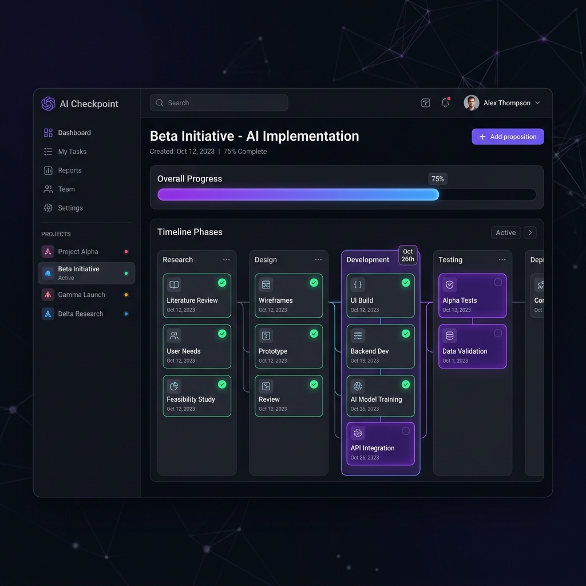

# AI Checkpoint Dashboard



This is the official Vue 3 + Vite dashboard for AI Checkpoint, built to provide a visual interface over the CLI's JSON states.

## Commands

- **Development:** `npm run dev`
  Starts the Vite dev server with hot-reload and the Express backend on port 20226.

- **Build:** `npm run build`
  Compiles the Vue 3 application into static files in the `dist/` directory.

- **Production:** `npm start`
  Runs the Express backend to serve the static `dist/` build on port 20226.

## Dependencies

- **Vue 3:** Reactive UI framework.
- **Vite:** Lightning-fast build tool.
- **Express:** Backend API server connecting the UI to the AI Checkpoint CLI.
- **Lucide Vue Next:** Icon library.
- **Tailwind CSS:** Utility-first styling framework.

## Project Structure

- `src/` - Vue 3 frontend application.
  - `components/` - Reusable UI widgets.
  - `hooks/` - Composition API logic.
  - `server/` - Express backend API routes and CLI integrations.
- `index.html` - Vite entry point.
- `tailwind.config.js` - Styling configuration.

## Adding Projects

The dashboard uses an Express backend to bridge between the web and the local filesystem.
To add new AI Checkpoint projects to the dashboard, you use the API:

```bash
# Add a project by providing its absolute path and an alias/name
curl -X POST http://localhost:20226/api/projects \
  -H "Content-Type: application/json" \
  -d '{"name": "My Project", "path": "/path/to/my/project"}'
```

Once added, the backend executes local `./l` CLI commands in that directory and serves the progress JSON to the dashboard.
